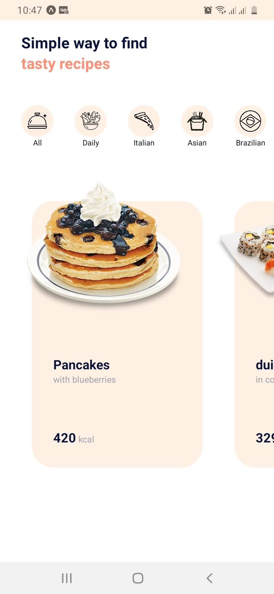
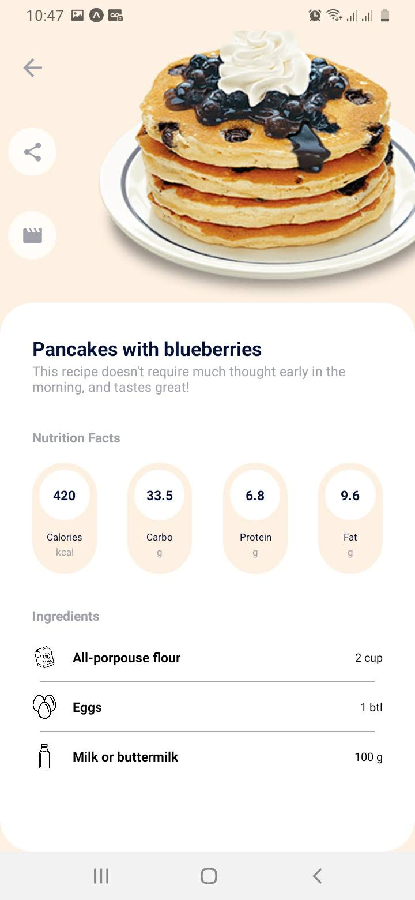

# App de Receitas
Este repositório contém o layout base para um aplicativo de receitas. Há duas telas, uma para o menu principal e outra para os dados da receita.

## Tecnologias Usadas
- React Native (em TypeScript)
- React Navigation
- React Vector Icons
- Expo
- Styled Components
- Lorem Ipsum (gerador de texto placeholder)

#### Contribuidores
Iasmin Q. Moura ([iasminqmoura](http://github.com/iasminqmoura "iasminqmoura"))
Leonardo L. Q. Marrega ([leo1553](http://github.com/leo1553 "leo1553"))
